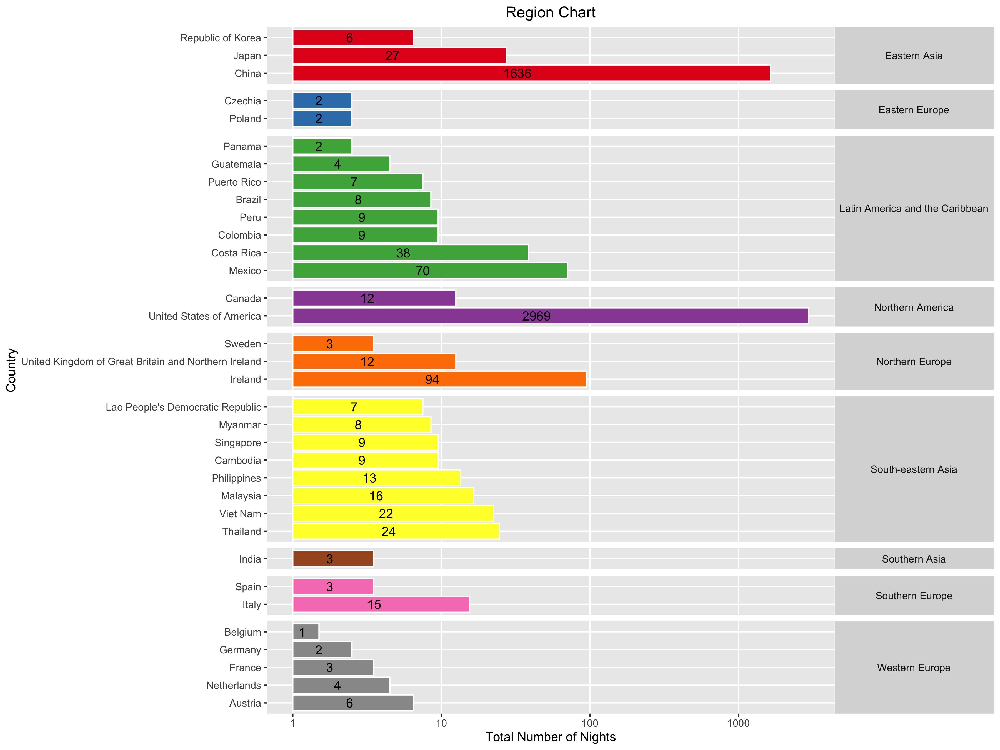

*Story*

I have been keeping track of my locations since 2008. As a result, I can make some fun visuals.

Simple map of these locations colored by year, sized by number of nights

Tile plot of major cities of the world, classified into Alpha Beta Gamma bsaed on economic and cultural impact by a think tank

Simple chart of number of nights in each country, grouped by regions

